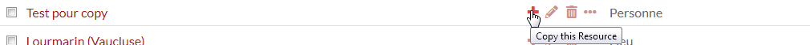

# ItemCopy Module for Omeka S

This module allows logged users in the Admin Dashbord to quickly make a duplicate operation on Resources, which could be helpful when a lot of items are very similar.  
Once installed and activated, the module adds a new button in the actions list in the browse View. Clicking this button will copy and paste in a new item all properties, class, modele... of the selected item.  

## Installation

See general end user documentation for [Installing a module](https://omeka.org/s/docs/user-manual/modules/#installing-modules)

## How it works ?

It works with Ajax calls to the REST API of the Omeka S Installation which transports Item's Datas in JSON-LD Format.  
One call is a GET one to make a READ API Operation on the selected Resource's data (GET /api/items/:id), the JSON-LD response is passed to a POST call fot creating a new Resource (POST /api/items)

## Usage

A few parameters need to be customized directly in the asset/item-copy.js file (starting lines of the file)  
* the current url of the Omeka S Installation : by default the url is set to the Location origin Property of the current Location Object (for example http://example.com), if the admin url contains a pathname, you have to set in manually (for example http://example.com/bib/omeka-s)  
* The key_identity and key_credential parameters : to perform a GET operation on a non-public Resource or/and a POST operation to create a new Resource, the API requests must be authentified with key_identity and key_credantial parameters. These 2 parameters are given for admin user by activating an API Key in the API keys tab of their user edit page.

## Todo

Add a filter to the GET API response to get only the properties of each Item, and not the media ressources or the item set for example
